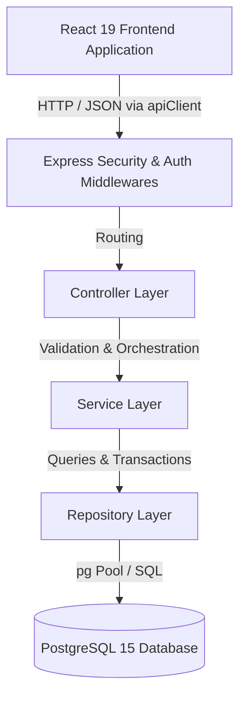

# AI CLUB — System Architecture Documentation

## 1. Overview

AI CLUB is a student-centered artificial intelligence community platform designed to foster peer learning, technical project collaboration, and research initiatives.
Sprint 1 establishes the production-grade foundation, stabilization, data isolation, and authentication subsystems.

---

## 2. Architectural Blueprint

The application employs a decoupled Client-Server architecture utilizing a strict layered pattern on the backend and single-source-of-truth state management on the frontend:

---

## 3. Layer Breakdown

### 3.1 Frontend (`src/`)

- **UI Components (`src/components/`)**:
  - `layout/`: App shells (`AuthLayout`, `DashboardLayout`, `AdminLayout`, `RoleGuard`).
  - `ui/`: Design-system primitives (`Button`, `Input`, `Select`).
  - `common/`: Standard async feedback views (`LoadingState`, `ErrorState`, `EmptyState`, `StateView`).
- **Context & State (`src/context/`)**:
  - `AuthContext.tsx`: Single source of truth for session management, token persistence, user hydration (`GET /api/auth/me`), and global unauthorized event interception.
- **Central API Client (`src/api/`)**:
  - `client.ts`: Canonical HTTP client providing automated Bearer token injection, normalized baseUrl resolution, and typed `ApiError` conversion.
  - `auth.api.ts`: Dedicated typed service for authentication operations.

### 3.2 Backend (`server/src/`)

- **Entry & Server (`app.ts`, `server.ts`)**:
  - Configures security headers via `helmet`.
  - Configures environment-aware `cors` policy.
  - Structured request logging (`timestamp`, `method`, `path`, `statusCode`, `durationMs`).
  - Standardized health check (`GET /api/health`).
- **Middleware (`src/middleware/`)**:
  - `auth.ts`: `authenticate` verifies signed JWT Bearer tokens and attaches minimal identity `{ userId, role }`. `requireRole` and `requireAdmin` enforce role boundaries with case-insensitivity.
  - `errorHandler.ts`: Central Express error interceptor converting `ZodError`, PostgreSQL constraint codes (`23505`, `23503`), and `AppError` into unified API error contracts without leaking sensitive stack traces.
  - `rateLimiter.ts`: Sliding-window IP rate limiter on sensitive endpoints returning standard HTTP 429 payloads.
- **Controllers (`src/controllers/`)**:
  - Extract parameters, trigger Zod validation, delegate to domain services, and return standardized success/paginated responses via `sendSuccess` and `sendPaginated`.
- **Services (`src/services/`)**:
  - Execute business logic, password hashing via `bcrypt`, and multi-table transactions (`BEGIN` / `COMMIT` / `ROLLBACK`).
- **Repositories (`src/repositories/`)**:
  - Encapsulate SQL statements with 100% parameterized arguments to guarantee immunity against SQL injection attacks.
- **Database Engine (`src/db/`)**:
  - PostgreSQL client connection pool (`pg.Pool`).
  - Idempotent migration runner (`migrate.ts`) tracking applied scripts in a `migrations` table.
  - Development database seeding (`seeds/001_initial_seed.ts`).

---

## 4. Security Principles

1. **Defense in Depth**: Frontend client guards (`RoleGuard`) provide responsive UX navigation, while Backend middleware (`authenticate`, `requireRole`) strictly enforces access policies on every request.
2. **Credential Safety**: Passwords require a minimum of 8 characters, are hashed with salt rounds via `bcrypt`, and are never stored in plaintext, logged, or returned in API responses.
3. **Least Privilege JWTs**: JWT claims contain only minimal non-sensitive identifiers (`userId`, `role`) with enforced expiration.
4. **Injection Prevention**: All SQL queries utilize parameterized placeholders (`$1`, `$2`, etc.), preventing SQL injection.
5. **No Blind Trust**: Request validation occurs on all inbound payloads via `zod` before reaching business services.
