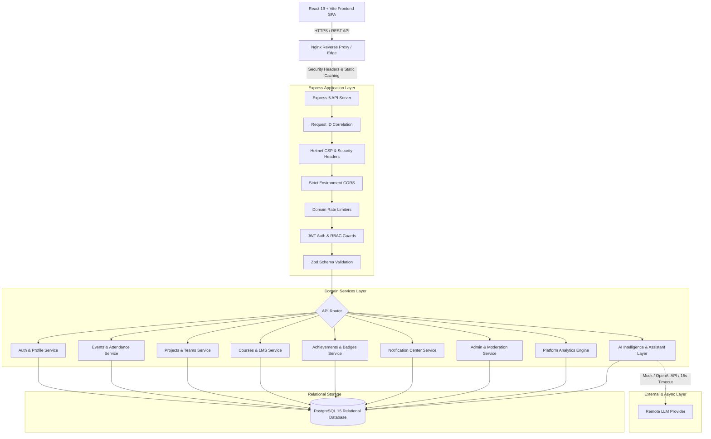

# AI CLUB — Complete System Architecture (v1.0.0 Production)

## 1. System Overview

**AI CLUB** is an enterprise-grade artificial intelligence student community and learning platform. The system bridges peer-to-peer technical project collaboration, curriculum-driven learning, gamification, and context-aware artificial intelligence.

The architecture emphasizes **strict layer separation**, **database integrity as single source of truth**, **least privilege authorization**, **resilient observability**, and **zero client-side trust**.

---

## 2. High-Level Architectural Blueprint

---

## 3. Layer Breakdown

### 3.1 Frontend (`src/`)
- **Technology Stack**: React 19, TypeScript, React Router 7, Lucide Icons, Vite.
- **Layouts & Guards**:
  - `AuthLayout`: Unauthenticated public view for registration and sign-in.
  - `DashboardLayout`: Primary authenticated student shell with responsive navigation and unread notifications badge.
  - `AdminLayout`: Dedicated admin control shell with analytics, user moderation, and audit logs.
  - `RoleGuard`: Route-level authorization guard preventing student access to administrative views.
- **State & Context**:
  - `AuthContext`: Centralized authentication state with automatic token rehydration and token clearance on 401s.
- **API Client Layer**:
  - `src/api/client.ts`: Canonical Axios/Fetch wrapper with automatic Bearer token injection and normalized error contracts.

### 3.2 Backend API Server (`server/src/`)
- **Runtime**: Node.js 20 LTS, Express 5, TypeScript.
- **Middleware Chain**:
  1. `requestId.ts`: Attaches unique UUIDs (`X-Request-Id`) across request lifecycles.
  2. `helmet`: Enforces OWASP-recommended Content Security Policy (CSP), HSTS, and frame protections.
  3. `cors`: Restricts inbound origins to trusted production domains.
  4. `rateLimiter.ts`: Sliding-window rate limiters partitioned by risk (`authLimiter`, `aiLimiter`, `exportLimiter`, `apiLimiter`).
  5. `auth.ts`: Verifies HMAC-signed JWT tokens and enforces case-insensitive RBAC claims.
  6. `errorHandler.ts`: Standardized error envelope interceptor suppressing database internals in production.
- **Probes**:
  - `/health` and `/api/health`: Liveness probe for process uptime.
  - `/ready` and `/api/ready`: Readiness probe verifying PostgreSQL connection pool health.

### 3.3 Domain Services Layer
- **Members & Profiles**: Student profiles, graduation years, technical skills, and research interests.
- **Events & Attendance**: Scheduled workshops, seat reservation concurrency control, registration status transitions, and check-ins.
- **Projects & Teams**: Collaboration workspaces, atomic team capacity limits, team invitation state machines, and milestone progress tracking.
- **Courses & LMS**: Multi-module curriculum, structured lessons, rich article/video content, and completed lesson progress tracking.
- **Achievements & Badges**: Data-driven criteria evaluation awarding points and recognized badges on verified member activity.
- **Notifications**: Instant user-targeted alert distribution with read tracking and preference filters.
- **Admin Control Center**: Comprehensive moderation dashboard, member status toggle, role elevation, and CSV reporting.
- **Platform Analytics**: Aggregate queries measuring engagement, course completions, and attendance metrics.
- **AI Intelligence Layer**: Grounded search, recommendation engines, skill gap analyzers, and conversational student assistant with privacy boundary isolation.

### 3.4 Relational Database (`server/src/db/`)
- **Engine**: PostgreSQL 15.
- **Integrity**: Enforced foreign keys with cascading deletes where appropriate, unique constraints preventing race conditions, and composite indexes for sub-10ms query performance.
- **Migrations**: Automated runner (`migrate.ts`) tracking migrations in an idempotent `migrations` table (13 production migrations).

---

## 4. Security Principles

1. **Defense in Depth**: Client-side UX guards coupled with mandatory server-side middleware authorization.
2. **Zero Client Trust**: All mutations validate parameters against server-side schemas. Client-supplied roles and member IDs are never trusted.
3. **Parameterization**: 100% of SQL queries utilize parameterized placeholders (`$1`, `$2`), eliminating SQL injection vulnerabilities.
4. **Credential Isolation**: Secrets exist only in environment variables. Secrets are forbidden in client bundles and Git history.
5. **Fail Safe AI**: LLM failures, rate limits, or timeouts never impair core educational platform workflows.
