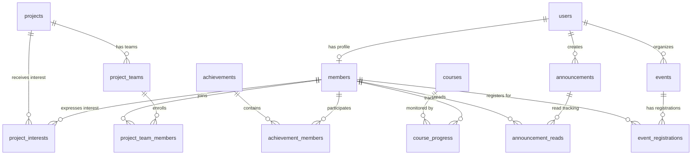

# AI CLUB — Database Architecture & Schema Specification

## 1. Overview

AI CLUB utilizes a relational PostgreSQL 15 database configured with connection pooling (`pg.Pool`), primary and foreign key constraints, cascading deletions, and secondary B-tree indexes for fast lookup and query execution.

---

## 2. Entity Relationship Overview



---

## 3. Core Tables

### 3.1 `users`

Authentication credentials and system authorization level.

- `id` (UUID, Primary Key, `gen_random_uuid()`)
- `email` (VARCHAR(255), Unique, Not Null)
- `password_hash` (VARCHAR(255), Not Null)
- `role` (VARCHAR(50), Not Null, CHECK (`role IN ('student', 'admin')`))
- `created_at` (TIMESTAMPTZ, Default NOW())
- `updated_at` (TIMESTAMPTZ, Default NOW())

### 3.2 `members`

Academic identity and club profile details.

- `id` (UUID, Primary Key, `gen_random_uuid()`)
- `user_id` (UUID, Foreign Key -> `users(id)` ON DELETE CASCADE)
- `full_name` (VARCHAR(255), Not Null)
- `register_number` (VARCHAR(100), Unique, Not Null)
- `department` (VARCHAR(100), Not Null)
- `class_section` (VARCHAR(50), Not Null)
- `year` (INT, Not Null)
- `college_email` (VARCHAR(255), Unique, Not Null)
- `phone` (VARCHAR(50))
- `status` (VARCHAR(50), Default 'Active')
- `bio` (TEXT)
- `github_url` (VARCHAR(1000))
- `linkedin_url` (VARCHAR(1000))
- `portfolio_url` (VARCHAR(1000))
- `skills` (TEXT[])
- `technical_interests` (TEXT[])
- `joined_at` (TIMESTAMPTZ, Default NOW())

### 3.3 Domain Tables

- `achievements`: Award recognitions, hackathons, publications (`achievement_members` junction).
- `updates`: Technology articles, club breakthroughs, curated tech summaries.
- `projects`: Collaborative AI projects, problems, expected outcomes.
- `project_interests`: Member interest bookmarks on projects.
- `project_teams` & `project_team_members`: Student project team squads and roles (`leader`, `member`).
- `courses` & `course_progress`: Learning curriculum catalog and individual completion tracking.
- `events` & `event_registrations`: Workshops, hackathons, seminars, and attendee registrations.
- `announcements` & `announcement_reads`: Club-wide broadcasts, priority levels, and member read receipts.

---

## 4. Migrations System

Migrations are managed programmatically via `server/src/db/migrate.ts`.
Applied migrations are recorded in the `migrations` table:

```sql
CREATE TABLE IF NOT EXISTS migrations (
  id SERIAL PRIMARY KEY,
  name VARCHAR(255) UNIQUE NOT NULL,
  executed_at TIMESTAMPTZ NOT NULL DEFAULT NOW()
);
```

### Execution Flow

1. Connect to PostgreSQL pool.
2. Query `migrations` for existing entries.
3. Compare against registered migrations list:
   - `001_initial_schema`
   - `002_add_member_profile_fields`
   - `003_add_events`
   - `004_add_project_teams`
   - `005_add_announcements`
4. Apply pending scripts inside transactional blocks (`BEGIN` / `COMMIT` / `ROLLBACK`).
5. Safe for repeated runs without duplicate execution errors.

### Running Migrations

```bash
# From repository root
npm run db:migrate

# Or from server directory
cd server && npm run db:migrate
```

---

## 5. Seeding System

Database seeding is managed via `server/src/db/seeds/001_initial_seed.ts`.
The seed script is idempotent using `ON CONFLICT DO UPDATE` or `ON CONFLICT DO NOTHING`.

### Default Development Credentials

- **Administrator**:
  - Email: `admin@aiclub.com`
  - Password: `admin123`
  - Role: `admin`
- **Student**:
  - Email: `student@aiclub.com`
  - Password: `student123`
  - Role: `student`
  - Register Number: `21BCE1001`
  - Department: `CSE`, Year: `3`, Section: `A`

### Running Seeds

```bash
# From repository root
npm run db:seed

# Or from server directory
cd server && npm run db:seed
```
